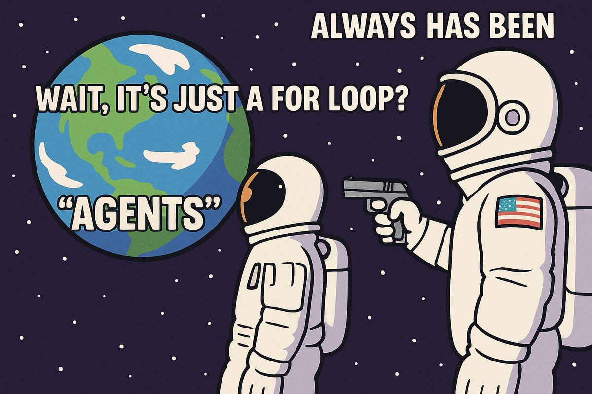

# agent-hack

The simplest possible agent: LLM + Tools + Loop

## The Bootstrap Challenge: Building Claude Code from Scratch

### The Concept
Start with an agent that can only READ files. Use it to teach yourself how to add WRITE. Then use READ+WRITE to add SHELL. This mimics how real development tools evolve!

## Setup

1. Install uv: 
   ```bash
   curl -LsSf https://astral.sh/uv/install.sh | sh
   ```
2. Create `.env` file: 
   ```bash
   echo "ANTHROPIC_API_KEY=your-api-key-here" > .env
   ```
3. Paste in your actual Anthropic API key
4. Run: 
   ```bash
   uv run agent.py
   ```

## Stage 1: READ Only (What you start with)
```bash
uv run agent.py
```

Your first conversation:
```
> Can you read agent.py and tell me how to add a write tool?
[Agent reads the file, sees the pattern, and gives you exact code to add]
```

## Stage 2: Adding WRITE (Manual step)
1. The agent gives you code for a write function
2. You manually paste this into agent.py
3. Update the tools list: `tools=[read, write]`
4. Restart the agent

## Stage 3: Adding SHELL (Automated!)
Now with both read and write:
```
> Can you read your own file (agent.py) and add a shell tool to yourself?
[Agent reads itself, generates shell function, writes it back to the file]
```

## Stage 4: Victory!
You now have a fully functional agent that you bootstrapped from almost nothing!

## Learning Objectives
- Understand how agents work by building one piece by piece
- Experience the limitations before solving them  
- See how tools enable other tools
- Learn the agent's code patterns by using the agent itself

## Bonus Challenges
Once you have all three tools:
- Build something that is actually cool using it... maybe with the GenAI tooling?
- Use it as a CLI tool 

## The Meta Lesson
You're using an AI agent to help you build an AI agent. This is how development works - we use tools to build better tools!